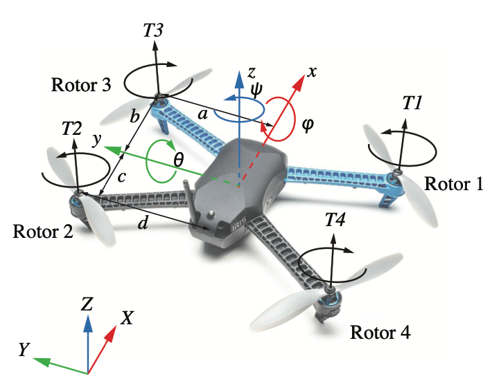

# Mathmetical Model of Quadrotor

## Frmae of Reference
<!---->

*The inertial frame and body frame*: ENU (East North Up -- X Y Z)

## Position
$$ 
\xi = \begin{bmatrix}
			x\\
			y\\
			z
		\end{bmatrix}
		, \quad
\eta = \begin{bmatrix}
			\phi\\
			\theta\\
			\psi
		\end{bmatrix}
$$

>$\xi$ : the absolute linear position in the intertial frame  
$\eta$ : Euler angles (i.e. attitude: angular position) in the inertial frame 
- $\phi$ : roll angle (rotation around the x-axis)  
- $\theta$ : pitch angle (rotation around the y-axis)  
- $\psi$ : yaw angle (rotation aroudn the z-axis)  

## Velocities
The origin of the body frame is in the center of mass of the quadcopter.

$$
V_B = \begin{bmatrix}
			V_{x,B}\\
			V_{y,B}\\
			V_{z,B}
		\end{bmatrix} 
		, \quad
		v = \begin{bmatrix}
			\dot{x}\\
			\dot{y}\\
			\dot{z}
		\end{bmatrix}\\
\omega = \begin{bmatrix}
			p\\
			q\\
			r
		\end{bmatrix} 
		, \quad
\dot{\eta} =  \begin{bmatrix}
			\dot{\phi}\\
			\dot{\theta}\\
			\dot{\psi}
		\end{bmatrix} 
$$
>$V_B$ : linear velocities in the body frame  
>$v$ : velocity of the center of mass in the inertia frame  
>$\omega$ : angular velocities in the body frame  
>$\dot{\eta}$: Euler angular velocity

## Rotation

The **rotation matrix $R$** from the body frame to the inertial frame

$$
R = \begin{bmatrix}
	C_\psi C_\theta & C_\psi S_\theta S_\phi - S_\psi C_\phi & C_\psi S_\theta C_\phi + S_\psi S_\phi \\
	S_\psi C_\theta & S_\psi S_\theta S_\phi + C_\psi C_\phi & S_\psi S_\theta c_\phi - C_\psi S_\phi \\
	-S_\theta & C_\theta S_\phi & C_\theta C_\phi \\
	 \end{bmatrix}
$$

> $R$ is orthgonal thus $R^{-1} = R^T$ 
> $S_x = sin(x)$ , $C_x = cos(x)$ , $T_x = tan(x)$

## Transformation 

The **transformation matrix $W_\eta$** for angular velocities **from the inertial frame $\dot\eta$ to the body frame** $\omega$

$$
\dot{\eta} = W_\eta^{-1}\omega, \quad 
\begin{bmatrix} \dot\phi \\ \dot\theta \\ \dot\psi \end{bmatrix} = \begin{bmatrix} 1 & S_\phi T_\theta & C_\phi T_\theta \\
0 & C_\phi & -S_\phi \\
0 & S_\phi / C_\theta & C_\phi / C_\theta
\end{bmatrix}
\begin{bmatrix} p \\ q \\ r \end{bmatrix} , 
$$
$$ 
\omega = W_\eta \dot\eta, \quad
\begin{bmatrix} p \\ q \\ r \end{bmatrix} = 
\begin{bmatrix} 1 & 0 & -S_\theta \\
0 & C_\phi & C_\theta S_\phi \\
0 & -S_\phi & C_\phi C_\theta
\end{bmatrix}
\begin{bmatrix} \dot\phi \\ \dot\theta \\ \dot\psi \end{bmatrix} 
$$

> $\dot{\eta}$ : Euler rate (angualr velocities in inertial frame)  
> $\omega$ : angular velocities in body frame

## Force and Torque

The **angular velocity of rotor** $\omega$ create **thrusts** $T_i$ in the direction of the rotor axis. The angular velocity and acceleration of the rotor also craete **torque** $Q_i$ of the ith motor.

$$ 
T_i = K_T\Omega_i^2, \quad Q_{M_i} = K_Q \Omega_i^2 + J_r \dot\Omega_i \approx K_Q \Omega_i^2
$$
> $\Omega_i$ : angular velocity of rotor i  
> $T_i$ : force in the direction of the rotor axis  
> $Q_{M_i}$ : torque around the rotor axis  
> $K_T$ : lift (thrust) constant (k)  
> $K_Q$ : drag constant (b) 
> $I$ : inertia matrix

The combined forces of rotors create thrust T in the direction of the body z-axis. Torque $\tau_B$ consists of the torques $\tau_\phi$ $\tau_\theta$ and $\tau_\psi$ in the direciton of the correspoinding body frame angles.

The external **torque** in the body axes
$$
\tau_B = \begin{bmatrix} 
	 	\tau_{\phi}\\
	 	\tau_{\theta}\\
	 	\tau_{\psi}
	 \end{bmatrix} 
	 = \begin{bmatrix} 
	 	-l_aT_1 + l_dT_2 + l_aT_3 - l_dT_4\\
	 	-l_bT_1 + l_cT_2 - l_bT_3 + l_cT_4\\
	 	-Q_1 - Q_2 + Q_3 + Q_4
	 \end{bmatrix} 
$$
>$T_i$ : thrust of the ith motor  
>$Q_i$ : torque of the ith motor

**The total trust and torque**

$$
T = \sum_{i=1}^{4}T_i = K_T \sum_{i=1}^{4} \omega_i^2, \quad T^B = \begin{bmatrix} 0 \\ 0 \\ T \end{bmatrix}
$$
(Plus Configuration - 1 2 3 4)
$$
\tau_B = \begin{bmatrix} \tau_\phi \\ \tau_\theta \\ \tau_\psi \end{bmatrix} = 
\begin{bmatrix} 
lK_T(\Omega_2^2 - \Omega_4^2) \\ lK_T(\Omega_3^2 - \Omega_1^2) \\ 
K_Q(-\Omega_1^2 - \Omega_2^2 + \Omega_3^2 + \Omega_4^2)
\end{bmatrix}
$$

(Cross Configuration - 1 4 2 3)
$$
\tau_B = \begin{bmatrix} \tau_\phi \\ \tau_\theta \\ \tau_\psi \end{bmatrix} = 
\begin{bmatrix} K_T(-l_a\Omega_1^2 + l_d\Omega_2^2 + l_a\Omega_3^2 - l_d\Omega_4^2) \\ 
K_T(-l_b\Omega_1^2 + l_c\Omega_2^2 - l_b\Omega_3^2 + l_c\Omega_4^2) \\
K_Q(-\Omega_1^2 - \Omega_2^2 + \Omega_3^2 + \Omega_4^2)
\end{bmatrix}
$$

> $l$ : the distance between the rotor and the center of mass of the quadrotor  
> $l_a \ l_b \ l_c \ l_d$ : front long, front short, back short, back long arm length

The **roll** movement is acquired by increasing the 2nd rotor velocity and decreasing the 4th rotor velocity. Similarly, the **pitch** movement is acquired by decreasing the 1st rotor velocity and increasing the 3th rotor velocity. **Yaw** movement is acquired by increasing the the angular velocities of two opposite rotors (1,3) and decreasing the velocities of the other two (2,4).

The final matrix (Cross Configuration - 1 4 2 3)
$$
\begin{bmatrix} T \\ \tau_\phi \\ \tau_\theta \\ \tau_\psi \end{bmatrix} = 
\begin{bmatrix}
K_T & K_T & K_T & K_T \\
-l_aK_T & l_dK_T & l_aK_T & -l_dK_T \\
-l_bK_T & l_cK_T & -l_bK_T & l_cK_T \\
-K_Q & -K_Q & K_Q & K_Q
\end{bmatrix} 
\begin{bmatrix}
\Omega_1^2 \\
\Omega_2^2 \\
\Omega_3^2 \\
\Omega_4^2 
\end{bmatrix} \\
$$

## Dynamics

The quadrotor is assumed to be rigid body and Newton-Euler equations can be used to describe the dynamics.  

$$ 
F = m\dot{v}, \quad \tau = I \dot{\omega} + \omega \times I\omega
$$

### Linear Acceleration

In the body frame, 

$$
F = F_g + F_{thrust} \\
m \dot{V_B} + \omega \times (mV_B) \approx m \dot{V_B} = R^TG + T_B \\
m R\dot{V_B} = G + RT_B \\
$$
> $m \dot{V_B}$: force for the acceleration of mass  
> $\omega \times (mV_B)$ : centrifugal force  
> $G$ : gravitational force  
> $T_B$ : total thrust of the rotors

In the inertial frame, the centrifugal force, $v \times (mV_B)$, is nullifed. Thus, the **acceleration of the quadrotor $\dot{v}$** 
$$
	m \dot{v} = G + RT_B \\
	\dot{v} = \begin{bmatrix} 
				\ddot{x} \\ \ddot{y} \\ \ddot{z} 
				\end{bmatrix} 
			= 1/m\begin{bmatrix} 0 \\ 0 \\ -mg \end{bmatrix} 
			+ R/m\begin{bmatrix} 0 \\ 0 \\ T \end{bmatrix} \\
			= \begin{bmatrix} 0 \\ 0 \\ -g \end{bmatrix} 
			+ \frac{T}{m}
			\begin{bmatrix}
				C_\psi S_\theta C_\phi + S_\psi S_\phi \\
				S_\psi S_\theta c_\phi - C_\psi S_\phi \\
				C_\theta C_\phi \\
			 \end{bmatrix}	
$$

### Angular Acceleration

In the body frame, the **angular accelration $\dot{\omega}$**
$$
	\tau = I\dot{\omega} + \omega \times \ (I\omega) + \Gamma \approx I\dot{\omega} + \omega \times \ (I\omega)
$$
$$
	\dot{\omega} = I^{-1} (-\omega \times \ (I\omega) + \tau)
$$
$$
	\dot{\omega} = \begin{bmatrix} \dot{p} \\ \dot{q} \\ \dot{r} \end{bmatrix} 
	= I^{-1}\Bigg(- \begin{bmatrix} p\\q\\r \end{bmatrix} \times
		\begin{bmatrix}
	 		I_{xx}p\\I_{yy}q\\I_{zz}r 
		\end{bmatrix} 
		+ \tau 	\Bigg)\\
	 = \begin{bmatrix} 
	 	(I_{yy}-I_{zz})/I_{xx} \ qr\\
	 	(I_{zz}-I_{xx})/I_{yy} \ pr\\
	 	(I_{xx}-I_{yy})/I_{zz} \ pq
	 \end{bmatrix}
	 + \begin{bmatrix} 
	 	\tau_{\phi}/I_{xx}\\
	 	\tau_{\theta}/I_{yy}\\
	 	\tau_{\psi}/I_{zz}\\
	 \end{bmatrix}\\
	 = \begin{bmatrix} 
	 	(I_{yy}-I_{zz})/I_{xx} \ qr\\
	 	(I_{zz}-I_{xx})/I_{yy} \ pr\\
	 	(I_{xx}-I_{yy})/I_{zz} \ pq
	 \end{bmatrix}
	 + \begin{bmatrix} K_T(-l_a\Omega_1^2 + l_d\Omega_2^2 + l_a\Omega_3^2 - l_d\Omega_4^2) \ /\ I_{xx}\ \\ 
K_T(-l_b\Omega_1^2 + l_c\Omega_2^2 - l_b\Omega_3^2 + l_c\Omega_4^2) \ / \ I_{yy}\ \\
K_Q(-\Omega_1^2 - \Omega_2^2 + \Omega_3^2 + \Omega_4^2)\ / \ I_{zz}\
\end{bmatrix}
$$

>$I\dot{\omega}$ : inertia  
>$\omega \times \ (I \omega)$ : centripetal forces   
>$\Gamma$ : gyroscopic forces  

### Motor dynamcis

The motor dynamcis can be approximated by a first order system.

$$
W(s) = \frac{K_m}{s+\alpha}U(s)\\
\dot{W} = -\alpha W + K_m u
$$

>$K_m$ : motor constant  
>$\alpha$ : motor dynamic pole  
>$u=[u_1,u_2,u_3,u_4]^T$: vector of input voltage to the motors 
>$W = \Omega^2$ ($\Omega$: angular velocity of motor i)  

## Dynamic Equation

System states as $x = [x\, y\, z\, \phi\, \theta\, \psi\, \dot{x}\, \dot{y}\, \dot{z}\, p\, q\, r \ W_1 \ W_2 \ W_3 \ W_4]^T$

The entire system model can be written into the following discrete form

$$
x_{k+1} = \mathcal{F}(x_k, u_k, w_k),\\
y_{k+1} = \mathcal{H}x_k + v_k
$$

>$k$ time step  
>$w$ disturbance  
>$v$ measurement noise  
>$y$ output  
>$\mathcal{H}$ identify matrix  

The system dynamic equeation can be wrttien as:
$$
\dot{x_1} = x_7 \\
\dot{x_2} = x_8 \\
\dot{x_3} = x_9 \\
\dot{x_4} = x_{10} + Sx_4Tx_5\cdot x_{11} + Cx_4 Tx_5 \cdot x_{12}\\
\dot{x_5} = Cx_4 \cdot x_{11} - Sx_4 \cdot x_{12}\\
\dot{x_6} = Sx_4/Cx_5\cdot x_{11} + Cx_4/Cx_5 \cdot x_{12} \\
\dot{x_7} = K_T/m(x_{13}+x_{14}+x_{15}+x_{16})(Cx_4Sx_5Cx_6+Sx_4Sx_6)\\
\dot{x_8} = K_T/m(x_{13}+x_{14}+x_{15}+x_{16})(Cx_4Sx_5Sx_6-Sx_4Cx_6)\\
\dot{x_9} = K_T/m(x_{13}+x_{14}+x_{15}+x_{16})(Cx_4Cx_5)-g\\
\dot{x_{10}} = (I_y-I_z)/I_xx_{11}x_{12} + K_T/I_x(-l_ax_{13} + l_dx_{14} + l_ax_{15} - l_dx_{16})\\
\dot{x_{11}} = (I_z-I_x)/I_yx_{10}x_{12} + K_T/I_y(-l_bx_{13} + l_cx_{14} - l_bx_{15} + l_cx_{16})\\
\dot{x_{12}} = (I_x-I_y)/I_zx_{10}x_{11} + K_Q/I_z(-x_{13} - x_{14} + x_{15} + x_{16})\\
\dot{x_{13}} = -\alpha x_{13} + K_mu_1\\
\dot{x_{14}} = -\alpha x_{14} + K_mu_2\\
\dot{x_{15}} = -\alpha x_{15} + K_mu_3\\
\dot{x_{16}} = -\alpha x_{16} + K_mu_4\\
$$

## Aerodynamical effects (optional)

Drag force gnerated by the air resistance

$$
\frac{1}{m}
	\begin{bmatrix}
	A_x & 0 & 0 \\
	0 & A_y & 0 \\
	0 & 0 & A_z \\
	 \end{bmatrix}	
	 \begin{bmatrix}
	\dot{x} \\
	\dot{y} \\
	\dot{z} \\
	 \end{bmatrix}
$$
Thus, the devised linear velocities to the force slowing the movement
$$
\dot{v} = \begin{bmatrix} \ddot{x} \\ \ddot{y} \\ \ddot{z} \end{bmatrix} 
	= -g \begin{bmatrix} 0 \\ 0 \\ 1 \end{bmatrix} + \frac{T}{m}
	\begin{bmatrix}
	C_\psi S_\theta C_\phi + S_\psi S_\phi \\
	S_\psi S_\theta c_\phi - C_\psi S_\phi \\
	C_\theta C_\phi \\
	 \end{bmatrix}	
	 - \frac{1}{m}
	\begin{bmatrix}
	A_x & 0 & 0 \\
	0 & A_y & 0 \\
	0 & 0 & A_z \\
	 \end{bmatrix}	
	 \begin{bmatrix}
	\dot{x} \\
	\dot{y} \\
	\dot{z} \\
	 \end{bmatrix}
$$

> $A_x, A_y, A_z​$ : drag force coefficients for velocities in the inertial frame

Several other aerodynamical effects could be included in the model. For example, dependence of thrust on angle of attack, blade flapping and airflow distruptions have been studied in many literatures. The influence of aerodynamical effects are complicated and the effects are difficult to model. Also some of the effects have significant effect only in high velocities. Thus, these effects are excluded from the model and the presented simple model is used. 

### Additional forces 

Drag force $F_D$ using Linear Aerodynamics 
$$
F_D = \frac{1}{2}\rho SC_DV^2
$$

where $S$ is the cross-sectional area of the quadrotor, $C_D = diag(C_{D_x}, C_{D_y}, C_{D_z})$ is the translational drag coefficient.

Rotational drag 
$$
\ddot{\phi_D}I_x = F_Dx_c \\
F_{D_t} x_c = Tl = \frac{1}{2}\rho C_A SV_t^2 = \frac{1}{2} \rho C_A S \omega_t^2 R^2 \\
$$

$$
F_D = \frac{Tl}{x_c} \Bigg( \frac{\omega}{\omega_t} \Bigg)^2 \\
\ddot{\phi_D} =  \frac{Tl}{I_x} \Bigg( \frac{\omega}{\omega_t} \Bigg)^2		\square
$$

Linear drag
$$
C_D = \frac{2mg}{\rho SV_t^2} \\
F_D = mg\Big(\frac{V}{V_t}\Big)^2 => a_{Drag} = g\Big(\frac{V}{V_t}\Big)^2
$$
